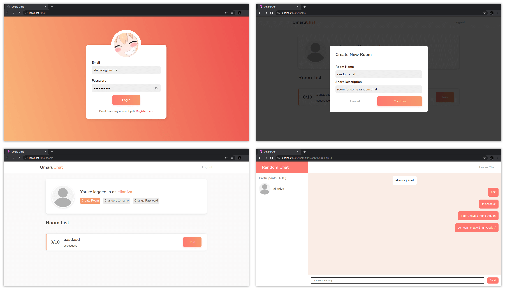

# Umaru Chat
Simple chat application built using React, Typescript and Firebase. Might be a bit buggy since this is my first time making something this big. This might looks like a small app but this is my biggest app yet. My first time using Typescript with React and Firebase so the code quality isn't top notch.

Took me about a month. To be fair, it shouldn't be that long if I'm not so busy with school stuff.

## Preview


This app isn't hosted anywhere. If you want to try it then you have to try it locally.

## Prerequisites
Before running this app, make sure to install all of its dependencies

```bash
npm install
```

Then fill out `src/components/Firebase/firebase.ts` config object with your own firebase config.

```js
const config = {
  apiKey: "",
  authDomain: "",
  databaseURL: "",
  projectId: "",
  storageBucket: "",
  messagingSenderId: "",
  appId: "",
  measurementId: "",
}
```

## Running the app
There are 2 commands.

Run this command to build
```bash
npm run build
```

Run this command to develop
```bash
npm run dev
```

# License

MIT © [Elianiva](https://github.com/elianiva/umaru-chat/blob/master/LICENSE)
